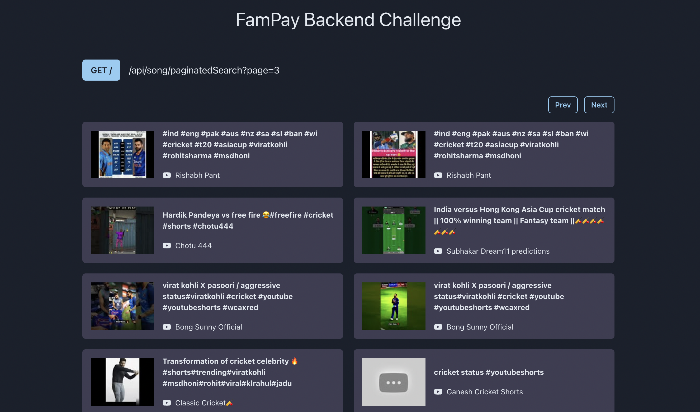
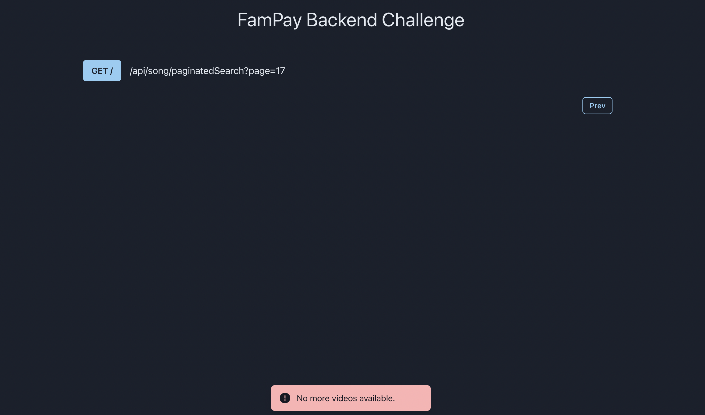
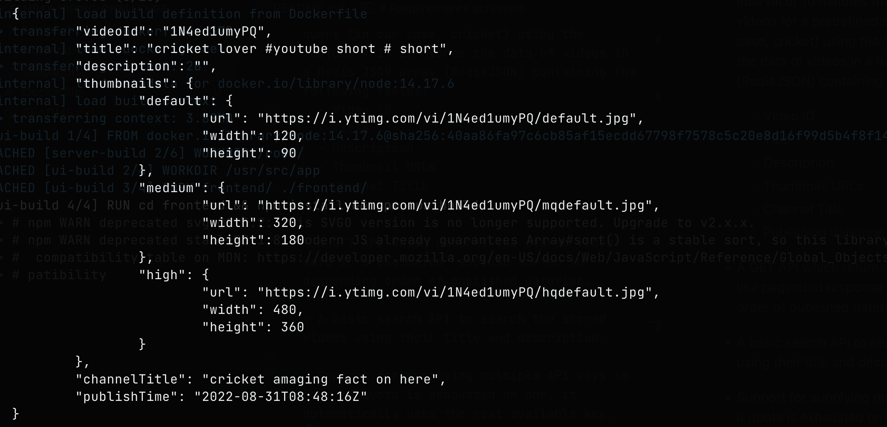
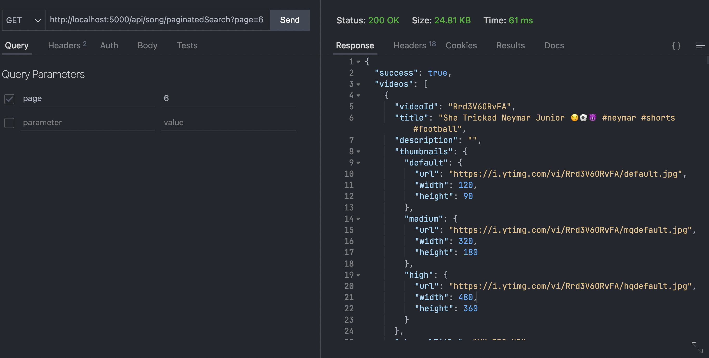
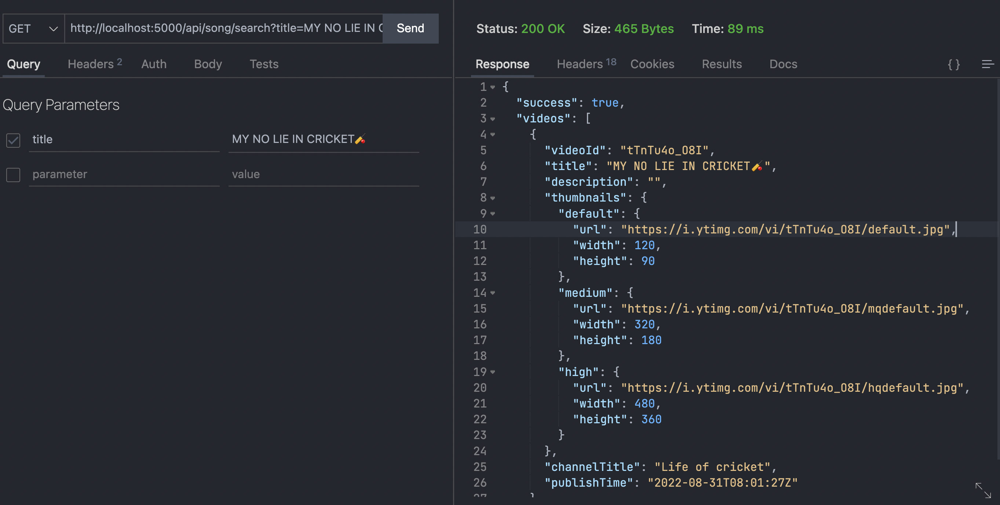

# Backend Assignment | FamPay

# Tech Stack
- JavaScript (Node.js)
- Redis with RedisJSON

# Project Goal

To make an API to fetch latest videos sorted in reverse chronological order of their publishing date-time from YouTube for a given tag/search query in a paginated response.

# Requirements achieved

- Node.js server runs the cron job at a regular interval of 10 minutes that fetches the latest videos for a predefined search query (in our case, cricket) using the YouTube API. It stores the data of videos in a Redis JSON array (RedisJSON) containing the following fields:
  - Video ID
  - Title
  - Description
  - Thumbnail URLs
  - Channel Title
  - Publishing datetime

- A GET API which returns the stored video data in a paginated response sorted in descending order of published datetime.
  
- A basic search API to search the stored videos using their title and description.

- Support for supplying multiple API keys so that if quota is exhausted on one, it automatically uses the next available key.

- A dashboard to view the stored videos in the paginated form.

## Dashboard


<br>



## Format of video stored in Redis



## Usage
### Get API
http://localhost:5000/api/song/paginatedSearch?page={page_number}



In the JavaScript code, it can be leveraged using the following service:
```javascript
import * as songApi from './services/song

const fetchResponse = async page => {
    const response = await songApi.paginatedSearch(page);
}
```


### Basic Search API
http://localhost:5000/api/song/search?title={title}&description={description}



In the JavaScript code, it can be leveraged using the following service:
```javascript
import * as songApi from './services/song

const fetchResponse = async page => {
    const response = await songApi.paginatedSearch(page);
}
```

## Points to note
- The GET API can return a maximum of 50 latest videos in a paginated response.
- To create the proof of concept (POC), the maximum number of most recent cricket videos that can be stored in the Redis database are limited to 2000 to save on API calls to YouTube.

## How to run it locally?

### Prerequisites:
- Node.js
- npm
- Redis with RedisJSON

I used the [redislab/rejson](https://hub.docker.com/r/redislabs/rejson/) Docker image to setup the Redis module.

1. Clone the repository.
2. Run the above Docker image (RedisJSON).
3. In the root directory of **backend**, create a `.env` file with the following contents:
```dosini
REDIS_HOST=localhost    
REDIS_PASSWORD=your_password_for_redis
REDIS_PORT=redis_port
```
4. Put your API key(s) in YOUTUBE_API_KEYS inside `apikeys.js` like so:

```javascript
const YOUTUBE_API_KEYS = [
  <api_key_1>,
  <api_key_2>,
  ...
];
```
5. In the root directory of **backend**, type: `npm install` to install dependencies.
6. Run `npm start` in root directory of **backend.**
7. In the root directory of **frontend**, type: `npm install` to install dependencies.
8. Run `npm start` in root directory of **frontend.**
9.  Your app should be running at localhost:3000 ✨